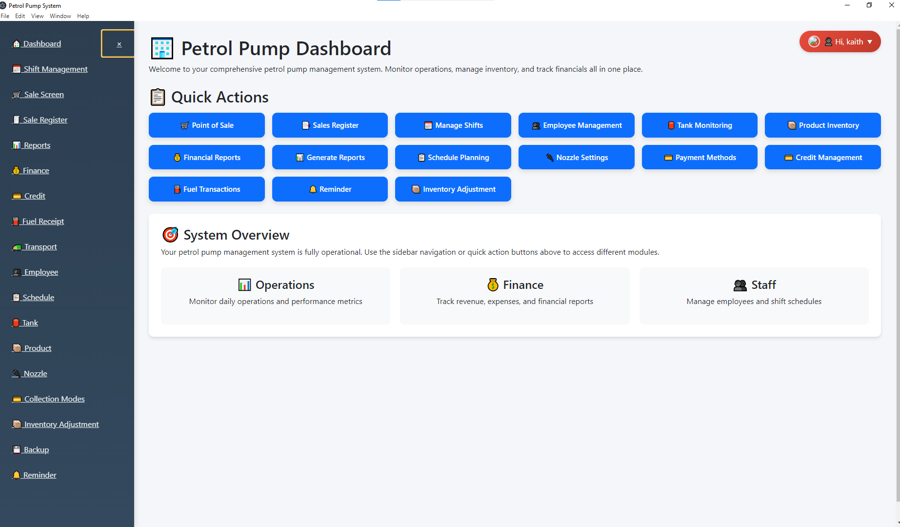
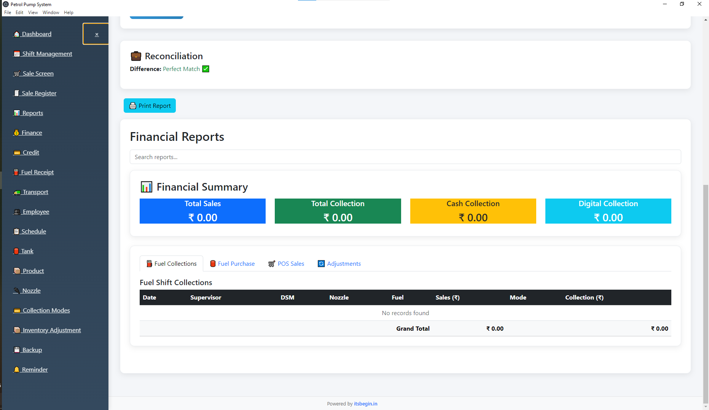
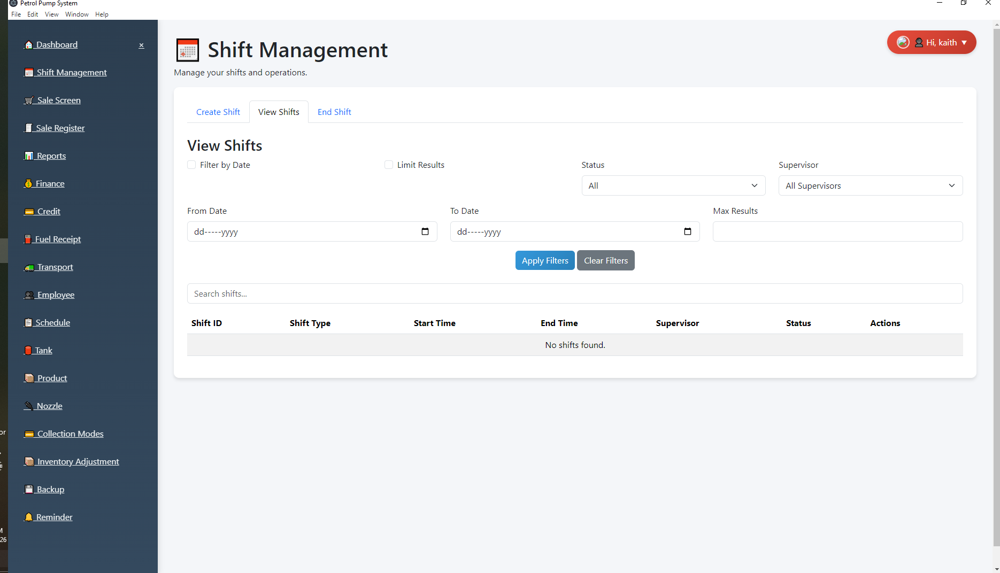

📘 Petrol Pump ERP System
Developed by ITSBegin System Solutions

🌐 https://itsbegin.in

📌 Overview

Petrol Pump ERP is a complete management system designed for fuel stations.
It manages:

Shift Management

Fuel Sales & Collection

POS (Non-Fuel Sales)

Inventory & Stock Ledger

Fuel Purchase

Adjustments

Finance Reports

User & Role Management

🏗 Tech Stack

Node.js

Koa.js

SQLite

EJS

Bootstrap 5

⚙ Installation
1️⃣ Install Node.js

Download from: https://nodejs.org

2️⃣ Install Dependencies
npm install
3️⃣ Run Project
npm start

Open in browser:

http://localhost:3000
📊 Modules
🔹 Shift Management

Start/End shift

Nozzle & DSM tracking

Automatic fuel sale calculation

🔹 Finance

Fuel Collection

Fuel Purchase

POS Sales

Inventory Adjustment

Ledger Summary

🔹 Inventory System

Ledger-based stock calculation

Backdated entries supported

Real-time stock snapshot

🔐 Security

Role-based access control

Supervisor & DSM level separation

Session-based authentication

📦 Build Desktop Version (Optional)

To create executable:

npm run build
🏢 Developed By

ITSBegin System Solutions
Professional ERP & Custom Software Development
🌐 https://itsbegin.in

## 📸 Screenshots

### 🖥️ Dashboard

---

### 📅 Finance

----------

### 📅 Shift

This project was initially inspired by an open-source project.
Significant modifications and custom development have been implemented.
If you are the original author and want attribution, please contact me.
## License

This project is proprietary and is not open for public use, distribution, or modification without explicit permission from the author.

© Vishav Bandhu. All rights reserved.
For commercial usage or licensing inquiries, 
please contact: mr.kaith@gmail.com Website:https://www.itsbegin.in/
